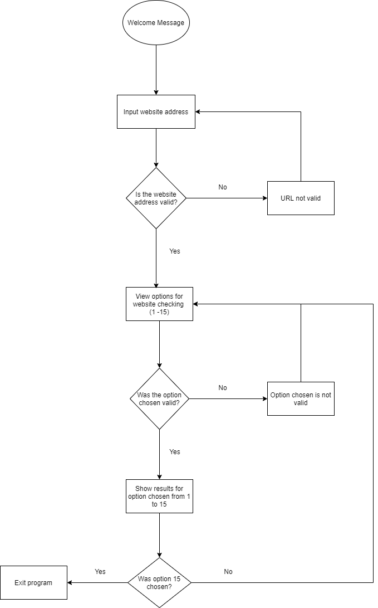

## Website Availability Application 

### Purpose

This is a Python 3 based OOP terminal application which tests the availability of your website and performs a health check which is sent to your email address through the SendGrid API. The program also includes automated tests and a CI/CD pipeline using GitHib actions.

The repository for this application can be found here: https://github.com/PandelisT/Website_Availability_Application.git.

### Description

The program is essentially composed of two loops: 
1) Checking the validity of a website address/URL that you wish to test.
2) Choosing between 15 options with regards to checking up on the website above.

The first loop essentially checks the validity of a website address through attempting to make a HTTP GET request to the desired URL within a try and except block. If the GET request is successful, the loop is broken whereas if the GET request response is not successful the loop continues until a valid website address is inputted.

The second loop simply checks whether the input given by the user is valid. The input is a number between 1 and 15 with option 15 being the program termination command. If a user does not input correctly the loop continues until a valid input is given and a result is displayed. The loop then continues until option 15 is chosen. 

Each invidual option is handled with a try and except block which tells the user if the operation is successful or not. There is a unique return value for successful and unsuccessful operations. If errors are encountered, there are three levels of handling. The initial error handling occurs in the class method for example, the get_pagespeed method in the WebsiteAvailability class, the second in the ChooseOptions class in views.py and the third is in the main.py file. 

Each of the 15 options are split into different classes and class methods:

- WebsiteAvailability class which handles from options 2 to 8. This includes methods to get the IP address, page speed, server and content type, SSL expiry and HTTP status.
- ScrapeWebsite class which handles option 12. This includes methods to get title, description, image, favicon, sitename and return last result.
- CheckHashAndPorts class which handles options 1, 9 to 11. This includes methods to ping the website with Nmap as well as scan for open ports.
- Views class which handles the first loop described above.
- ChooseOptions class which handles the second loop described above.

Below is a flowchart of the main functionality of the program:



### Dependencies

This is a list of the main modules used in this application (a full list can be found in the requirements.txt file in the src folder):

- beautifulsoup4 for website scraping
- colorama for colouring text in the terminal
- flake8 for checking code with PEP8 standards
- mypy for checking Python typehints
- python-whois for checking whois status
- python3-nmap for using Nmap in Python applications
- requests for making HTTP requests
- sendgrid for connecting to SendGrid
- json for reading and writing in json format
- sys for using environment variables
- os for exiting the program
- time for adding pauses to program

### APIs 

There are three different APIs used in this program.

1) [Google PageSpeed Insights API](https://developers.google.com/speed/docs/insights/v5/get-started). Please create an [API key](https://console.developers.google.com/apis/credentials).
The PageSpeed Insights API used to make GET requests and receive responses for the page performance and other key metrics such as First Meaningful Paint, Speed Index and Time to interactive. All of these gives the user information about the speed and performance of the webpage.
2) [Auth0 Signals API](https://auth0.com/signals/docs/). Sign up to create an [API key](https://auth0.com/signup).
The Auth0 Signals API is used to check if an IP address is blacklisted. The range of responses from the GET request is approximately -4 to 0, with 0 being the highest confidence.
3) [SendGrid API](https://sendgrid.com/docs/API_Reference/api_v3.html). Create an account and go to the [API key settings](https://app.sendgrid.com/settings/api_keys).
The SendGrid API is used to make a POST request to send an email report to the user about the health check performance.  

### Running automated tests and deploying the application

To run the application and/or automated tests on GitHub on Ubuntu follow these steps after you have installed Python 3 and the virtual environment:
1) Install Nmap: ```sudo apt-get install nmap```
2) Install the dependencies: ```pip install -r requirements.txt```
3) Set environment variables for ```TEST_DOMAIN```, ```TEST_IP_ADDRESS```, ```TEST_EMAIL``` and API keys for ```GOOGLE_API```, ```SIGNALS_API``` and ```SENDGRID_API``` in GitHub secrets.
4) For running the tests: ```cd``` into  ```src``` folder and run ```python -m unittest discover tests/```.

To deploy this application, please start an Amazon EC2 instance and include the public IPv4 address into the ```ci_cd_wapta.yml``` file as the host. You will then need to connect to the EC2 instance through your local computer, create a new user ```sudo adduser github-actions``` and ```sudo passwd -d github-actions``` to remove the password, create a SSH key pair and add the private key to GitHub secrets.

Please follow these steps if you want to deploy this application manually on a Linux OS:
1) ```sudo apt-get update```
2) ```sudo apt-get install nmap```
3) ```sudo apt-get install python3.8```
4) ```sudo update-alternatives --install /usr/bin/python3 python3 /usr/bin/python3.8 2```
5) ```sudo apt install python3-pip```
6) ```sudo ssh-keygen # For path enter /home/github-actions/id_rsa```
7) ```cd /home/github-actions```
8) ```sudo mkdir .ssh```
9) ```sudo mv id_rsa.pub .ssh/authorized_keys```